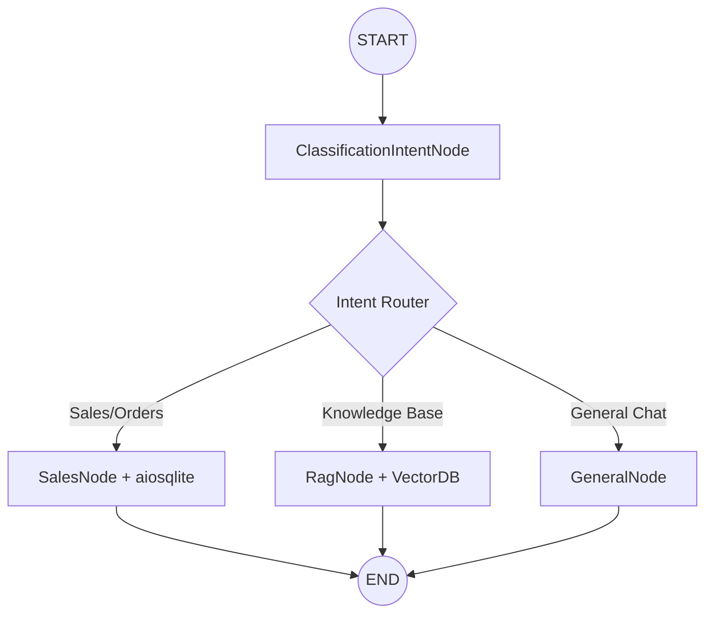

---

# Agent-Support-Pilot: Enterprise Multi-Agent Orchestration 🤖

**High-Performance AI Agent Architecture | LangGraph | FastAPI | RAG | Human-in-the-Loop**

## 🚀 The Vision

Agent-Support-Pilot is a **Stateful Agentic System** designed to handle complex, non-linear customer support journeys. By utilizing cyclic graphs instead of linear chains, the system can self-correct, loop back for missing information, and escalate to humans only when necessary. 

**Project Title:**    Agent Support Pilot

**The Problem:**      Traditional support bots are linear and brittle.

**The Solution:**     A multi-agent system built on LangGraph that uses a state-of-art machine approach and Python, LangChain intelligence layer to handle non-deterministic workflow.

---

## 🏗 System Design & Graph Flow

The core of the system is a **Directed Acyclic Graph (DAG)** orchestrated by LangGraph. Every request is treated as a state transition, ensuring context continuity and deterministic routing.

### The Workflow:

* **ClassificationIntentNode (START)**: Acts as the gateway, utilizing high-reasoning LLMs to extract user intent, entities, and sentiment.
* **Conditional Routing**: A logic-gate that evaluates the classification output to determine the next optimal node.
* **SalesNode**: Integrated with `aiosqlite` for asynchronous retrieval of order details and customer history, ensuring the agent has "live" business context.
* **RagNode**: Executes vector-backed policy retrieval using ChromaDB to answer knowledge-based inquiries.
* **GeneralNode**: Handles low-stakes conversational engagement and empathetic responses.
* **END**: State is consolidated, and the final response is streamed back to the client.

---

## 🛠 Architectural Innovations

### 1. Production-Grade State & Checkpointing

Architecture is built with a clear separation between development agility and production resilience.

* **Persistence Strategy**: While the project utilizes `InMemorySaver` for rapid dev-loop testing, the architecture is pre-configured for `aiosqlite` or `Postgres` checkpointers in production. This allows for **resumable conversations** and multi-day session persistence.
* **Concurrency**: Built on an `asyncio` foundation to handle high-throughput support environments without blocking threads.

### 2. Optimized RAG Pipeline & Cost Management

* **Dynamic Ingestion**: Automated processing for PDF/Docx using `pypdf` and `Unstructured` loaders.
* **Contextual Integrity**: Leveraged native Document Loader partitioning with tuned Overlap Management to ensure seamless context continuity and prevent loss of semantic meaning at segment boundaries.
* **Token Optimization**: Reduced operational costs and latency (approx. **-40%**) by implementing request-scoped `output_max_token` and `reasoning_effort` configurations per node.

### 3. Frontend Integration (Upcoming)
The system is designed with a **Headless UI**, allowing for seamless integration with modern web frameworks.
* **Angular Enterprise Suite**: Currently architecting a high-performance dashboard using **Angular 21** to provide real-time monitoring of agent states, token usage, and human-in-the-loop intervention interfaces.
* **Reactive State**: Utilizing RxJS for managing real-time WebSocket streams between the FastAPI backend and the Angular frontend.

---

## 🗺 Project Roadmap

| Phase | Milestone | Tech Stack | Status |
| :--- | :--- | :--- | :--- |
| **Phase 1** | Core Graph & RAG Pipeline | LangGraph, ChromaDB | ✅ Complete |
| **Phase 2** | Async Persistence & Scaling | aiosqlite, FastAPI | ✅ Complete |
| **Phase 3** | **Next Gen Frontend** | **Angular, Tailwind CSS** | 🚧 In Progress |
| **Phase 4** | Advanced Observability | LangSmith, Prometheus | 📅 Planned |

---

## 💻 Technical Proficiencies

| Domain | Expertise |
| --- | --- |
| **Agentic Frameworks** | LangGraph (Cyclic Graphs, State Management), LangChain (Runnables, LCEL). |
| **LLM Orchestration** | Prompt Engineering (Few-Shot, System Persona), Token Budgeting, Dynamic Reasoning Configs. |
| **Vector Databases** | ChromaDB, Hybrid Search, FastEmbed (BAAI/bge-small-en-v1.5). |
| **Backend Architecture** | FastAPI, Asyncio, WebSockets, Middleware, Pydantic V2. |
| **Database Systems** | **`aiosqlite`** for high-performance async relational data fetching & persistence. |
| **Data Engineering** | Document Loaders (PDF, DOCX), Metadata Filtering. |

---

## 📊 Business Impact (The "ROI")

* **Cost Efficiency**: Smart routing to SLMs (Small Language Models) for general chat reduces API overhead by ~30%.
* **Human-in-the-Loop**: Designed to reduce support ticket volume by automating the 80% of repetitive queries, freeing human agents for high-value tasks.
* **Accuracy**: RAG-constrained prompts eliminate hallucinations by strictly grounding responses in the `VectorDB` context.
* **Reliability**: Pydantic schema validation build a guardrail against each request from the user in the web socket then to the Langraph Nodes then json response to user. 

---

> ## 💼 Why Work With Me?
>
> As an **AI Architect**, I specialize in transforming "cool AI demos" into **stable, cost-effective, and observable production services**. Whether you are looking for a Senior Architect to lead your AI transition or a Freelancer to build a custom Agentic workflow, I focus on:
>
> 1. **Scalability**: Systems that don't break under load.
> 2. **Predictability**: Eliminating hallucinations and ensuring brand alignment.
> 3. **Observability**: Global `requestId` tracing and structured logging for auditability.

---
